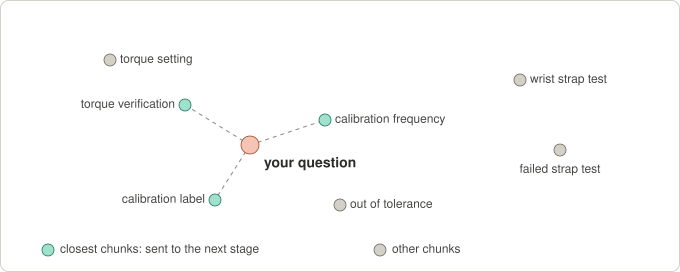

# How the document-control assistant works: a learning guide

Written on 2026-09-21 next to the RAG spike kit in this folder, for someone who has been running the kit's
commands and wants to understand them. Read sections 1 to 6 once, do the experiments in section 7, test
yourself in section 8, and keep section 9 (the glossary) for reference. The code named here lives in
[`rag_spike.py`](rag_spike.py). The numbers come from the production box (8x RTX PRO 6000, DeepSeek V4.1 Flash
served by SGLang) and are collected in section 5.

## The map: what we did, and why

| What we did | Why | What it told us or decided |
|---|---|---|
| Read the codebase and `CLAUDE.md` | The assistant must obey the document-control rules | Index only the current effective revision, check permissions in the service layer, make every answer citable |
| RAG vs "LLM wiki" | Pick the architecture | A wiki is an uncontrolled second copy that goes stale when an SOP is revised, so RAG wins |
| `nvidia-smi`, `ps`, `docker inspect` | Find out what hardware and model exist | 8 GPUs; DeepSeek V4.1 Flash runs in Docker on GPUs 0-3; GPUs 4-7 were free; port 8010 is local-only |
| Smoke test | Measure the model server like an instrument before designing around it | Thinking is off by default; about 9k prompt tokens per second; prefill requests queue, so cap doc-control at 2-3 calls |
| Embedding and rerank containers | Retrieval needs models too | Qwen3-Embedding-4B (2560 numbers per chunk) and bge-reranker-v2-m3 |
| Dry run on 3 example documents | Prove the plumbing before spending QA's time | Everything works; reranking costs about 20 ms; low thinking costs about 0.5 s |
| Next: QA's real documents and questions | Quality can only be measured on real data | Choose the embedding model, whether to rerank, whole documents vs chunks, and the thinking level |

## 1. The problem and the idea

An LLM learned from public text. It has never seen your SOPs. Ask it "how often are torque drivers calibrated
here?" and it writes a fluent, confident guess. That is a *hallucination*, and in an ISO 9001 setting a
confident wrong procedure is worse than no answer.

The fix is an *open-book exam*. Before asking the model, we find the relevant paragraphs in the current approved
documents and paste them into the prompt. We tell the model to answer only from them, cite them, and say "not
found" if they do not cover the question. That is *RAG*: Retrieval-Augmented Generation.

It is two separate jobs: *retrieval* (a search problem) and *generation* (a writing problem). Most failures are
retrieval failures: if the right paragraph never reaches the prompt, even the best model cannot answer
correctly. That is why the kit measures retrieval separately from generation.

Fine-tuning is the other obvious alternative, but it bakes today's revision into the model, so it cannot cite and
goes stale at the next revision. An "LLM wiki" (model-written summary pages) has the same staleness problem plus
no approval workflow, which is the failure a document control system exists to prevent.

## 2. The pipeline: two phases

Think of a library. *Indexing* is cataloguing the books once. *Asking* is the librarian finding the right pages
and answering while pointing at page numbers.

- **Indexing (once per document revision):** extract text, chunk it, embed each chunk, store it.
- **Asking (every question):** embed the question, search by meaning and by keywords, merge the results, rerank,
  build the prompt, let the LLM write the answer, then check the citations.

## 3. Each step, with what we ran

### 3.1 Extract

PDFs and Word files become plain text with page numbers, because search and models work on text, not files
(`extract_pdf`, `extract_docx` in the kit; PDFBox and Gotenberg in the real app). Pitfalls: scanned PDFs have no
text (the kit reports "NO EXTRACTABLE TEXT"), tables get flattened, and a watermark stamped into a download
would pollute every chunk, which is why we index the original file.

Your own 25 ENG documents showed three more, and each is invisible until you go looking:

- **Text boxes.** Flowcharts and picture captions in Word are often drawn as text boxes, which the usual
  reader (`python-docx`) skips. The first extraction silently missed 1,372 words: half of WI-ENG-0007 and of
  SOP-ENG-0007, plus the whole flowchart in SOP-ENG-0006. The kit now reads them (as `Diagram text: ...` lines).
- **Pictures.** The process flow in SOP-ENG-0002 to 0005 is a PNG, and the cable matrix in WI-ENG-0011 to 0015 is
  one too. No text extractor can read those; only OCR or a vision model could. Until then the assistant cannot
  answer from them, and it should say so instead of guessing.
- **Two languages.** Every work-instruction step is repeated in Bahasa Malaysia, so those chunks carry each fact
  twice, in two languages. That is fine for a multilingual embedding model and it lets Malay questions work, but
  it fills the top-k slots with near-copies.

The lesson: check what the extractor sees before judging retrieval. A wrong answer often starts here.

### 3.2 Chunk (`chunk_blocks`)

We cut each document into passages of about 260 words, overlapping by 40, never crossing a heading.

- **Why:** a search result should be the paragraph that answers, not a 20-page document. Models also have length
  limits (your reranker's is 8,194 tokens).
- **The trade-off:** too small and you lose context ("it must be recalibrated": what is "it"?). Too big and the
  meaning blurs. The overlap protects sentences at boundaries.
- **The header:** each chunk is prefixed with `SOP-QA-0010 - Calibration Control - 5.2 Calibration Frequency`, so
  the chunk knows where it lives. That helps search and citations, and `index --no-header` lets us test it.

### 3.3 Embeddings (`Embedder`)

A model turns a piece of text into a list of numbers (2560 of them for Qwen3-Embedding-4B).

- **The map of meaning:** think of the numbers as coordinates. Texts with similar meaning land close together,
  whatever their wording. "How often must gauges be recalibrated?" lands near "Gauges are calibrated every 12
  months" even though they share almost no words.
- **Cosine similarity:** closeness is the angle between the two arrows (1 means the same direction, 0 means
  unrelated). We scale every vector to length 1, so similarity is just a dot product, and comparing a question
  against the whole index took 11 ms.
- **Instructions on queries:** questions and passages are different kinds of text, so models like Qwen3 want a
  task instruction on the query side only (`Instruct: ... Query: ...`). That is `--query-prefix`. The wrong
  prefix quietly gives worse results.
- **Weakness:** an exact identifier like `FORM-QA-0031` has little "meaning", which is why we also use keyword
  search.



The real map has 2560 dimensions and this picture squashes it to two. What matters is the distances: the question
lands near the calibration and torque chunks and far from the ESD ones. The three closest chunks (teal) go on to
the next stage.

### 3.4 Keyword search, BM25 (`BM25`, `tokenize`)

The classic search-engine method (Elasticsearch uses it by default, and Postgres full-text search is a close
cousin).

- **How it scores:** it counts how many of the question's words a chunk contains, weights rare words more (a
  chunk containing "0031" beats one containing "the"), and damps repeats and very long chunks.
- **Strength:** exact tokens such as document numbers, form numbers and acronyms.
- **Weakness:** it has no idea that "recalibrate" and "calibrated" are related.
- **Our tokenizer:** it keeps `SOP-QA-0010` whole and also as `sop`, `qa` and `0010`.

### 3.5 Merge, hybrid search with RRF (`rrf`)

We run both searches and merge them. Their scores cannot simply be added, because cosine similarity runs from 0
to 1 while BM25 is unbounded. So we use *ranks*: each chunk earns `1/(60 + rank)` from each list, and we add the
results.

- **Worked example:** chunk A is rank 1 by meaning and rank 2 by keywords, so it scores 1/61 + 1/62 = 0.0325.
  Chunk C is rank 3 and rank 1, so it scores 1/63 + 1/61 = 0.0323. Chunk B is only rank 2 by meaning, so it
  scores 0.0161. The order is A, C, B.
- **The principle:** a chunk that both methods like beats one that only one likes.
- **Document-number shortcut:** if the question names a document number, that document's chunks go first
  (`boost_doc_number`).

### 3.6 Rerank (`Reranker`)

Everything so far compares the question and each chunk *separately*: each becomes numbers on its own (a
"bi-encoder"). That is fast but approximate. A *cross-encoder reranker* reads the question and one candidate
*together* and outputs a relevance score. It is sharper but slower, so we apply it only to the top 30
candidates, at a cost of about 20 ms. It is like skimming titles first, then reading the shortlisted pages with
the question in mind.

### 3.7 Prompt and grounding (`build_sources`, `SYSTEM_PROMPT`, `build_prompt`)

The model receives three things:

- **The rules** (system prompt): use only the SOURCES, never outside knowledge, reply `NOT_FOUND` if they do not
  cover the question, cite as `[S2]`.
- **The SOURCES:** numbered, each labelled with document number, section and page.
- **The QUESTION.**

`--mode chunks` sends the top 8 passages. `--mode docs` sends whole top documents (up to 40k tokens by default),
which gives more context (definitions, exceptions elsewhere in the document) but costs time; we measured about
4.5 s of prefill for 40k tokens. Because every claim carries a label, answers are checkable, and the kit flags
citations to labels it never provided.

### 3.8 The LLM (`answer_question`)

A *token* is roughly three-quarters of a word. There are two very different speeds:

- **Prefill:** reading the prompt, all tokens at once. This server does about 9k tokens per second.
- **Decode:** writing the answer one token at a time, at roughly 100-150 tokens per second.

That is why a long prompt costs seconds up front and a long answer costs seconds afterwards.

- **Thinking:** the model writes hidden scratch-work first (returned separately as `reasoning_content`), then
  the answer. It helps multi-step problems and costs time. It is controlled by `reasoning_effort` (`none` up to
  `max`) and is off by default on this server.
- **Temperature:** the randomness in choosing each next token, which is why two runs differ slightly.

## 4. The servers

- **SGLang** is an inference server. It loads model weights into GPU memory and serves them over HTTP. We use
  three OpenAI-style endpoints: `/v1/chat/completions`, `/v1/embeddings` and `/v1/rerank`. To our code a model is
  just a URL and a name, so swapping models means changing configuration.
- **Docker with `--gpus device=N`:** each server owns one GPU. `-p 127.0.0.1:PORT:PORT` makes it reachable only
  from the box itself. `-v ~/hf-cache:/hf` keeps downloaded weights so restarts are fast.
- **The spike containers:** `emb-qwen` (GPU 4, port 8011) and `rerank` (GPU 7, port 8012). Stop them with
  `docker stop emb-qwen rerank`, start them again with `docker start emb-qwen rerank`, remove them with
  `docker rm -f emb-qwen rerank`.
- **DeepSeek V4.1 Flash** (per its model card) is a *mixture of experts*, a panel of specialists. It has 552B
  parameters in total, but only about 8B are consulted per token while prefilling and 16B while decoding. That
  gives big-model quality at small-model speed. *Tensor parallel 4* means each layer is split across 4 GPUs.
  *FP8/FP4* means numbers are stored in 8 or 4 bits instead of 16, so the model fits. The *KV cache* is the
  model's working memory of the prompt; the card quotes about 890 bytes per token, which is why several users can
  send long prompts.

## 5. How we measured, and how to read the numbers

### What we measured on 2026-09-21

| Measurement | Result |
|---|---|
| Time to first token vs prompt size | 1,909 tokens: 0.3 s. 9,253: 1.1-1.3 s. 27,878: 3.2 s. 56,671: 6.4 s (about 9k tokens per second) |
| Three simultaneous ~8k-token requests | All finished at 3.0 s; first answers at 1.4, 2.3 and 3.0 s (prefill is serialized) |
| Decode speed | Roughly 100-150 tokens per second on short answers (rough; timings rounded to 0.1 s) |
| Thinking control | Off by default. Top-level `reasoning_effort` accepts none, minimal, low, medium, high, xhigh, max; integers are rejected with HTTP 400. `chat_template_kwargs` `thinking: true` also works. An integer effort inside `chat_template_kwargs` alone does nothing |
| Cost of thinking | On a 10k-token prompt about +0.2 s (35 reasoning tokens); on ~840-token prompts 0.4 s became 0.9 s |
| Embedding | Qwen3-Embedding-4B: 2560 dimensions; 16 chunks in 0.1 s; question embedding plus search median 11 ms (30 ms with reranking) |
| Dry run on 3 example documents | 100% on every metric; generation p50 0.4 s without thinking, 0.9 s with `low` |

### The first real evaluation: 25 ENG documents, 59 questions

Retrieval (47 answerable questions): right document first / in the top 5 was dense 83% / 96%, keyword (BM25) 87% /
98%, hybrid 87% / 98%, hybrid plus reranker **98% / 100%** (MRR 0.99). Keywords beat meaning at rank 1 because SOP
text is full of exact tokens (`SWOT03`, `R863A`, `13 cables`); the reranker earned its place by fixing the
near-duplicate documents, the flowchart question and a Malay question. Every method is good at "top 5 of 25
documents", so that number is saturated and cannot rank options; the rank-1 column is where the differences show.

Generation with the strict prompt, whole documents (`docs`) vs top chunks (`chunks`):

| | docs | chunks |
|---|---|---|
| said `NOT_FOUND` on the 12 unanswerable questions | 12/12 | 12/12 |
| answered the 47 answerable ones (did not abstain) | 44 | 43 |
| cited an expected document | 46 | 47 |
| invalid citations | 0 | 0 |
| latency p50 / p95, average prompt tokens | 2.2 s / 4.2 s, 6.6k | 1.6 s / 3.5 s, 2.7k |

What it taught:

- **The safety property held.** Even the near-miss traps (a torque for a model whose document gives none, an
  operating temperature that exists only for a different product) got `NOT_FOUND`, with a useful "what the sources
  do cover".
- **The label can lie while the content is right.** The false abstentions (3 in docs mode, 4 in chunks mode) were
  mostly replies that began `NOT_FOUND:` and then gave the correct answer, after an over-cautious reading ("not for
  a *finished* rack", "no *general* requirement"). In docs mode every one of the 47 answers contained the expected
  facts, abstentions included. So the interface should show the text with a banner instead of hiding it, and the
  prompt rule can be sharpened (`--prompt partial`, an experiment in this kit).
- **The judge cannot see what is missing.** For "which SOPs keep records for 7 years" the docs run named 3 of the 6,
  because only 3 documents were in its context, and the judge (which sees the same context) called it correct.
  Completeness needs a check against the golden set, and list-style questions need wider retrieval (the chunks run
  found all 6).
- **Chunks can cut a step in half.** One chunks answer said the source "is cut off at Swap", because the rest of the
  step was in the next chunk. The usual fix is to add the neighbouring chunk when a chunk is used.
- **A model quotes what it is given.** Three answers repeated a login and password that sit in plain text in the
  SOPs, one of them while refusing another question. Decide at indexing time whether secrets are redacted.
- **Good news you did not ask for.** When a document contradicted itself (13 vs 14 cables, two part numbers), the
  assistant said so and cited both, which is rule 4 working.

### The smoke test calibrated an instrument

Time to first token grew roughly linearly with prompt size. Three simultaneous requests queue instead of speeding
up, which is why doc-control should cap itself at 2-3 model calls at once. The "needle" test hides one sentence in
57k tokens of filler: it shows the model can read long text, not that it reasons well across a long document.

### Two mistakes worth remembering

- **Noise vs signal.** My first smoke-test logic said "use kwargs" because token totals differed (28, 30, 29). That
  was noise: the model writes slightly different answers each run. The real signal, reasoning tokens, was 0 in all
  three rows. Decide which number actually proves a claim, repeat measurements, and expect noise.
- **Check assumptions cheaply.** I assumed SGLang ran on the host, but `/opt/sglang/...` did not exist there
  because it runs in Docker. A five-second `docker ps` beats an assumption.

### The golden set is unit tests for search

It is a fixed list of real questions with known right documents and facts. After any change (chunk size, model,
prompt) you rerun it and compare. Without it, "seems better" is just a feeling.

| Metric | What it means | Why it matters |
|---|---|---|
| doc hit@k | An expected document is among the top k results | Did retrieval find the right document at all? |
| MRR@10 | Average of 1/rank of the first correct document (1.0 is perfect, 0.5 means typically second) | Rewards ranking the right document higher |
| fact hit@k | An expected fact string appears in the top-k chunks | Stricter: the right passage was retrieved, not just the right document |
| abstained on unanswerable | The model said `NOT_FOUND` when the documents do not cover it | The safety metric: no invented procedures |
| citation validity | Citations point at sources that were actually provided | Guards against fake citations |
| judge faithful/correct | A second LLM call grades the answer | A screen only: the same model grading itself is biased, so read the failures |
| latency p50/p95 | Median and 95th-percentile time | What a typical and an unlucky user wait |

An *ablation* means changing one thing at a time (dense only, then keyword only, then hybrid, then plus rerank)
to see which part earns its keep.

The 100% on the dry run proves the plumbing, nothing more. Three easy documents cannot show quality. Real SOPs
with tables, scans and cross-references will fail somewhere, and the failures list is where you learn. Also
avoid tuning until the golden set is perfect, or you will fit it and not the real world.

### When you have no real questions: synthetic golden sets

You can have a model write the questions (`synth_questions.py`, or Claude reading documents you share). That is
useful, but know exactly what you are getting:

- **Good for:** exercising the whole pipeline at scale, comparing settings against each other (embedding model A vs
  B, reranking on or off, chunk size), and catching regressions while you build.
- **Not good for:** quoting an absolute accuracy. Generated questions lean on the source passage's wording, which
  flatters keyword search and makes retrieval look easier than it is. They also cannot capture how real colleagues
  phrase things (vague, abbreviated, wrong terminology), and a question written by the same model family being
  tested tends to suit it.
- **How the generator fights this:** varied personas and styles, a rule against copying the passage, a check that
  the facts really appear in the passage, a second call confirming the passage alone answers it, unanswerable
  questions verified against what retrieval returns, and a wording-overlap score you can inspect.
- **Calibrate it:** run the eval on the synthetic set and on any real questions you can get (even ten written by
  you). If synthetic scores 95% and real scores 75%, the synthetic set is about twenty points optimistic: trust its
  comparisons, not its level.

### The Claude-written set for your ENG documents

`questions.csv` holds 59 questions Claude wrote after reading all 25 documents: 47 answerable and 12 that the
documents do not answer. Each answerable question has an expected document and short literal facts, and
`make_golden.py --verify` checks that every fact really is in the text the index will hold. Each unanswerable
question was searched for in all 25 documents first. A `kind` column labels what each question is testing, and
the eval report shows one row per kind, so a weak spot shows up by name:

| kind | what it tests |
|---|---|
| near-duplicate | R863A vs R863A CX8 vs R860ADXBB, or firmware vs test-software SOPs: near-identical text where only the title or one word differs |
| diagram, table | answers that live in a flowchart text box or in a big table of near-identical rows |
| paraphrase, malay | the question shares few words with the answer, or is in another language |
| aggregate, multi-doc | the answer needs several documents; one retrieved is a hit, so read the answer |
| neg-* | not answerable: a near miss (the document exists but omits the detail), general knowledge, a document that is referenced but not indexed, or out of scope |

Some facts are short numbers (`13 cables`, `18`). They are weak as text matches, so for the near-duplicate kind the
signal is *which document the answer cites*, not the fact string. Read those failures by hand.

## 6. Why it is shaped this way for document control

- **Current revision only:** only the current effective revision is indexed, so the assistant cannot quote a
  superseded SOP.
- **Citations:** every answer cites document, section and page, so a user can open the controlled copy.
- **Permissions:** access is checked by the existing service layer, not by the vector store.
- **`NOT_FOUND`** is a valid answer.
- **Audit:** every question is logged.
- **Originals:** we index the original file, not the stamped download.
- **Reconcile by diff:** the app compares "eligible" with "indexed", so obsolete and trashed documents drop out
  even though they never pass through `promoteVersion`.

## 7. Learn by doing (about 20 minutes)

These use two learning tools in the kit: `search` shows what each retrieval method returns, and `ask --prompt
loose` removes the safety rules. They need the updated `rag_spike.py` on the box:

```powershell
scp "C:\Users\Exp Local XYZ\Downloads\doc-control\spike\rag\rag_spike.py" overclock@192.168.9.138:~/rag-spike/
```

Set up the box shell (the `docker start` line is only needed if you stopped the servers; wait for "ready to roll"
in their logs):

```text
# on the box, in ~/rag-spike with the venv active
docker start emb-qwen rerank
export LLM_API_KEY=$(ps -eo args | grep '[s]glang.launch_server' | sed -n 's/.*--api-key \([^ ]*\).*/\1/p' | head -n1)
export EMB_BASE_URL=http://127.0.0.1:8011/v1
```

### Experiment 1: see what the model sees

```text
python rag_spike.py ask --index idx_example "How often must torque drivers be calibrated?" --mode chunks --rerank --show-context
```

Look at the SOURCES block, the `[S1]` labels, and how the answer uses only them. The rules are in `SYSTEM_PROMPT`.

### Experiment 2: watch meaning and keywords disagree

```text
python rag_spike.py search --index idx_example "How frequently should we recalibrate the screwdriver-type torque tools?" --rerank
python rag_spike.py search --index idx_example "FORM-QA-0031" --rerank
```

The first question shares almost no words with the SOP, so compare the `dense only` and `bm25 only` lists. The
second is a bare form number, which keyword search should nail. On 3 documents the top hit may be the same
everywhere, so look at the lower ranks and the scores.

### Experiment 3: break chunking on purpose

```text
python rag_spike.py index --docs examples/docs --out idx_frag --chunk-words 8 --overlap 0 --no-header --query-prefix $'Instruct: Given a question about company procedures, retrieve the passages that answer it\nQuery: '
python rag_spike.py search --index idx_frag "How often must temperature probes be calibrated?" --top 3
```

The chunks are fragments, so "temperature" and "every 12 months" end up in different chunks. Compare with the
260-word chunks in `idx_example`.

### Experiment 4: remove the guardrails

```text
python rag_spike.py ask --index idx_example "What protective equipment is needed when handling isopropyl alcohol?" --mode chunks
python rag_spike.py ask --index idx_example "What protective equipment is needed when handling isopropyl alcohol?" --mode chunks --prompt loose
```

The example SOPs do not cover this. The strict prompt should say `NOT_FOUND`. The loose prompt may answer from
general knowledge, and a reader could not tell it is not from your SOPs. If the model refuses either way, that is
still informative, but you cannot assume it for every question. That is why the golden set has unanswerable
questions.

### Experiment 5: thinking on a multi-step question

```text
python rag_spike.py ask --index idx_example "A torque driver was last calibrated on 2026-03-15. When is it next due, and is it overdue on 2026-09-21?" --mode chunks --rerank
python rag_spike.py ask --index idx_example "A torque driver was last calibrated on 2026-03-15. When is it next due, and is it overdue on 2026-09-21?" --mode chunks --rerank --effort low --effort-via top
```

The correct answer is due 2026-09-15 (six months), so overdue by six days. Compare correctness, time and
`reasoning_chars`.

### Reading order for the code

`chunk_blocks`, `Embedder`, `tokenize` and `BM25`, `rrf`, `retrieve`, `build_sources` with `SYSTEM_PROMPT` and
`build_prompt`, `answer_question`, then `cmd_eval` with `render_report`, and finally `cmd_smoke` to see how the
server was measured.

## 8. Check yourself

1. Why can't we just ask the LLM?
2. Why chunk, and why overlap?
3. Why use both embeddings and BM25?
4. Why does RRF use ranks instead of scores?
5. What can a reranker do that embeddings cannot?
6. Why did 100% on the dry run not prove quality?
7. What is the most dangerous failure, and which metric watches for it?

Short answers:

1. It has not seen your SOPs and guesses fluently.
2. Chunking gives precise passages within model limits, and the overlap protects boundaries.
3. Meaning and exact tokens fail in different places.
4. Scores from different methods are not comparable.
5. It reads the question and passage together, which is sharper but slower, so it only sees the top candidates.
6. Three easy documents only prove the plumbing.
7. A confident answer from general knowledge instead of your SOP, watched by the unanswerable questions and the
   faithfulness check.

## 9. Glossary

| Term | Meaning |
|---|---|
| Ablation | Testing by changing one component at a time to see what each contributes |
| BM25 | Keyword scoring that favours rare words and damps repeats; strong on exact tokens |
| Bi-encoder | Embeds the question and the passage separately; fast, approximate (embeddings) |
| Chunk | A passage of a document (about 260 words here) that is embedded and searched as one unit |
| Context window | The most tokens (prompt plus answer) a model can handle in one request; this server allows 409,600 |
| Cosine similarity | How alike two vectors' directions are: 1 is identical, 0 is unrelated |
| Cross-encoder | Reads a question and a passage together and scores relevance; used as the reranker |
| Decode | Generating the answer one token at a time |
| Dimension | How many numbers an embedding has (2560 for Qwen3-Embedding-4B) |
| Embedding | A list of numbers representing the meaning of a text; similar meaning gives nearby vectors |
| FP8 / FP4 | Storing model numbers in 8 or 4 bits instead of 16, to save memory |
| Golden set | Fixed real questions with known right documents and facts, used as tests |
| Grounding | Forcing answers to rest on provided sources and cite them |
| Hallucination | Fluent output that is unsupported or wrong |
| hit@k | Share of questions whose expected document (or fact) appears in the top k results |
| KV cache | The model's working memory of the tokens processed so far |
| LLM-as-judge | Using an LLM to grade answers; a useful screen, biased when it is the same model |
| Mixture of experts (MoE) | Many specialist sub-networks where only a few are used per token |
| MRR | Mean reciprocal rank: the average of 1/rank of the first correct result |
| Needle in a haystack | A test that hides one fact in long filler to see whether the model finds it |
| OpenAI-compatible API | A de-facto standard HTTP interface (`/v1/chat/completions`, `/v1/embeddings`) that many servers copy |
| p50 / p95 | Median and 95th-percentile latency |
| Prefill | Processing the prompt, all tokens in parallel; measured at about 9k tokens per second here |
| System prompt | The standing rules sent with every request |
| RAG | Retrieval-Augmented Generation: find relevant text first, then generate an answer from it |
| Reasoning effort / thinking | Hidden scratch-work before answering; levels none to max on this server |
| Reranker | A cross-encoder that re-scores the top candidates from the first search |
| RRF | Reciprocal rank fusion: merge ranked lists by summing 1/(60 + rank) |
| SGLang | The inference server software that hosts the models |
| Temperature | Randomness in choosing the next token; higher means more varied output |
| Tensor parallelism | Splitting each layer's math across several GPUs (TP4 means 4 GPUs) |
| Token | A piece of text (about three-quarters of a word) that models read and write |
| TTFT | Time to first token: the wait before the first output arrives, dominated by prefill |
| Vector | A list of numbers; here, an embedding |

## 10. Where this goes next

1. Get QA's 25-30 real SOPs and 30-50 real questions (see the README, section 3, and `make_golden.py`).
2. Run the README's index and eval sequence on the real corpus and read the reports. They decide the embedding
   model, whether reranking and whole-document mode earn their cost, and the thinking level.
3. Write the plan-back (the design decisions as flags for approval), as the project's process requires.
4. Only then implement in the Java app: an index reconciler that syncs by diff, pgvector storage, the permission
   gate, `ai_query_log`, a streaming endpoint and an "Ask" drawer. One thing to plan for: Qwen3-Embedding-4B
   outputs 2560 dimensions, and pgvector can only index up to 2000 for its standard `vector` type, so use the
   `halfvec` type, a shorter output size, or no index (fine at this corpus size).
